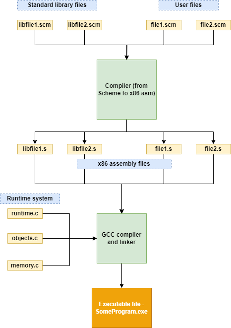
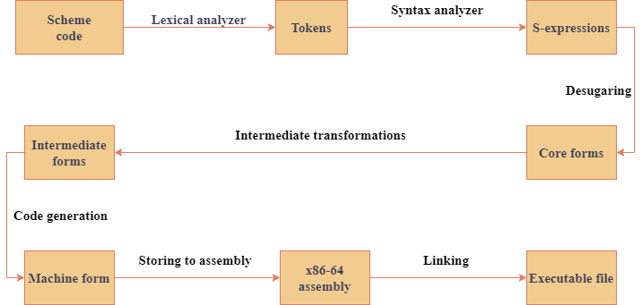

# Jik

A compiler from a subset of Scheme language to x86-64 architecture. Inspired by Abdulaziz Ghuloum's paper, "An Incremental Approach to Compiler Construction".

## Supported features
- I/O console
- Buffered file I/O
- Pairs
- Symbols
- Strings
- Vectors
- Garbage collection
- Complex constants
- `do` form
- `define` form
- `let*` form
- `apply` form
- Floating point numbers

## Building

Prerequisites:
* Windows
* .NET 6.0
* cygwin or msys2
* gcc

To build it, just run: 

```
dotnet build
```

## Running

Example of running the compiler:
```
dotnet run -p src\CompilerDriver examples\queens.scm
```

In the result, `misc\a.exe` file must be produced.

To run the test suite execute:
```
dotnet run -p src\App
```

## Overview of the implementation

This project contains a compiler and a runtime system. The compiler compiles Scheme programs to assembly language (x86) and creates an executable. The runtime system contains entry point for the program and a number of functions, that support communication with the OS (input/output, etc.). Also the runtime system contains a garbage collector.



The compiler receives a number of Scheme files, both user sources and library files. It transformes each of them to assembly files. Then it uses GCC compiler and linker to compile runtime system files (which are written in C) and link them with the assembly files. Finally, it produces an executable file.

### Compiler

Transformation of Scheme code to assembly language consists of a series of phases. The result of each phase is the input for the next phase. The initial input is the Scheme code. The final result is a file written in assembly language. The compiler is written in F# and the main part of it is located in [this](src/Jik/) directory.



The first phase is lexical analysis. Lexical analysis is the transformation of a sequence of characters into a sequence of tokens (lexemes).

The next phase is parsing, which analyzes the sequence of tokens, groups them according to grammar rules, and creates so-called s-expressions. 
An S-expression is a recursive data structure whose values can be either compound (so-called Cons cells) or simple, such as symbols and constants. Simple elements are also called atoms. Cells, unlike simple elements, can contain other cells and atoms.

After parsing, the next phase is the so-called desugaring. Syntactic sugar is a programming language construct that makes it easier for the user to work with the language and that can be implemented using existing constructs. Desugaring allows to reduce derived constructs to basic ones, which makes the internal representation of the language more compact and reduces the number of special cases in the implementation of the compiler. Desugaring produces Core forms. Then, a number of transformations are applied to Core form. One of them is alpha-renaming, which change variable names so that each variable has a unique name.

Core form is transformed to Intermediate form. In the Intermediate form, each function is divided into blocks. Each block consists of a sequence of variable definitions and ends with a jump statement. A jump statement can be return or conditional statement (if-then-else). Splitting into blocks simplifies code optimization and prepares conversion to assembly language.

The next phase is instruction selection, also known as machine code generation. The result of this phase is the Machine-form. This internal representation is the closest to the assembly language. This form is a sequence of instructions and labels. Each instruction contains an operation name and a set of operands. In this phase, each primitive operation from the Intermediate form is expanded into a sequence of several instructions.

After instruction selection, Machine form is converted into assembly code. This code is written to an assembly file with the .s extension, which will then be passed to the GCC compiler.

### Runtime system

The runtime system is located in [c/](c/) directory and consists of the following parts:

* Startup handling
* I/O handling
* Garbage collector

During the startup necessary memory is allocated and Scheme entry is called. The result value of the Scheme program is printed to the console.

Garbage collector is a simple mark-and-sweep collector. It uses two spaces: FromSpace and ToSpace, and a roots space. Usually, memory is allocated in FromSpaces. When FromSpace is full, garbage collection is started and all live objects are copied to ToSpace. Then, FromSpace and ToSpace are swaped. Roots space helps to determine live objects.